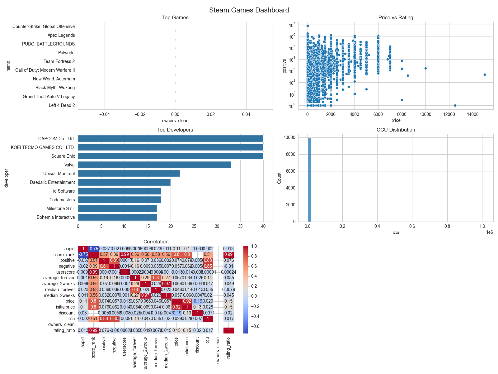
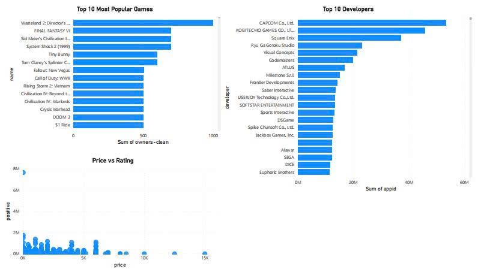

# 🎮 Steam Games Analysis

## 📌 Project Overview

This project analyzes a dataset of Steam games to explore trends in popularity, pricing, and player engagement. The objective is to identify key factors that contribute to a game's success.

---

## 📊 Dataset

* Source: Steam Games Dataset
* Records: ~10,000+ games
* Features include:

  * Game name
  * Price
  * Developers
  * Number of owners
  * Positive/negative ratings
  * Concurrent players (CCU)

---

## 🛠️ Tools & Technologies

* Python (Pandas, Matplotlib, Seaborn)
* Power BI (Interactive Dashboard)
* GitHub (Version control)

---

## 🔍 Data Processing

* Removed duplicate records
* Converted owners range into numerical values
* Created new feature: rating ratio
* Handled missing values
* Selected numerical features for correlation analysis

---

## 📈 Exploratory Data Analysis

### 1. Top Popular Games

* Identified games with the highest number of owners
* Highlighted the most successful titles

### 2. Price vs Ratings

* Analyzed relationship between price and user ratings
* Found weak correlation between price and satisfaction

### 3. Top Developers

* Identified developers with the most published games
* Observed dominance of major studios

### 4. CCU Distribution

* Analyzed concurrent player counts
* Most games have low player activity with a few outliers

### 5. Correlation Analysis

* Examined relationships between numerical features
* Found moderate correlation between ratings and ownership

---

## 📊 Dashboards

### 🐍 Python Dashboard (Matplotlib + Seaborn)

Includes 5 visualizations:

* 🎯 Top Games by Owners
* 💰 Price vs Rating
* 🏢 Top Developers
* 📊 CCU Distribution
* 🔥 Correlation Heatmap




---

### 📊 Power BI Dashboard

Includes:

* 🎯 Top Games by Popularity
* 💰 Price vs Rating Scatter Plot
* 🏢 Developer Analysis
* 📊 Player Activity (CCU)
* 📌 Key Metrics (Total Games, Average Price, Ratings)


[powerbi_dashboard.pbix](dashboard/powerbi_dashboard.pbix)
---

## 💡 Key Insights

* Popular games have significantly higher ownership
* Price has weak correlation with user satisfaction
* A small number of developers dominate the market
* Most games have low concurrent player counts

---

## 📁 Project Structure

```bash

steam-games-analysis/
│
├── data/
│   └── steam_games_dataset.csv
│
├── src/
│   └── analysis.py
│
├── images/
│   ├── top_games.png
│   ├── price_vs_rating.png
│   ├── top_developers.png
│   ├── ccu_distribution.png
│   └── correlation_heatmap.png
│
├── dashboard/
│   ├── python_dashboard.png
│   └── powerbi_dashboard.jpg
│
└── README.md

```
---

## 🚀 Future Improvements

* Add machine learning model to predict game success
* Build automated ETL pipeline
* Deploy dashboard online
* Integrate real-time Steam data

---

## 👤 Author

* Student in Data / Data Engineering track
* Focused on building real-world data projects

---

⭐ If you find this project useful, feel free to star the repository!
